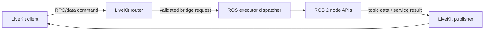

# Architecture

This guide explains the basic system shape, what is stable, and what is expected to change. For protocol details, read [protocol.md](protocol.md). For future direction, read [roadmap.md](roadmap.md).

## System in one minute

`livekit_ros2_bridge` sits between a LiveKit room and a ROS 2 graph. Clients in LiveKit can ask the robot to publish to topics, subscribe to topics, and call services. The bridge validates each request, applies access rules, and then runs the ROS operation.

Today, most traffic is JSON over LiveKit RPC/data packets. That is good for commands, control signals, and small messages. It is not the long-term path for high-rate camera and large binary payloads.

## Two-plane model (now and next)

A useful mental model is control plane versus media/data plane.

The control plane is the command path. It carries subscribe, unsubscribe, service call, and small telemetry messages. We keep this path simple because it is where permissions and request behavior are enforced.

The media/data plane is the payload path for high-rate or large data. The roadmap moves image and binary transport to LiveKit byte streams and video tracks, so large payloads are not forced through packet-size limits.

This split is the main architectural direction described in [roadmap.md](roadmap.md).

## How requests move through the system

The router runs on the LiveKit side and handles protocol parsing plus validation. It does not call ROS APIs directly. Instead, it hands work to the ROS executor thread through a dispatcher. This keeps ROS interactions in one place and avoids many thread-safety bugs.

## Code layout

`livekit_ros2_bridge/core/` contains protocol models and pure-Python helpers. It should stay free of ROS 2 and LiveKit SDK imports so it remains easy to test.

`livekit_ros2_bridge/livekit/` contains room/session lifecycle code, incoming RPC/data routing, and outgoing publication to LiveKit.

`livekit_ros2_bridge/ros2/` contains ROS-facing code for publishers, subscriptions, service calls, and executor dispatching.

`livekit_ros2_bridge/runtime.py` is the composition root, which means it is the wiring point that chooses implementations and connects them. The project loosely follows a ports-and-adapters style (also called hexagonal architecture): inside code defines small interfaces, outside code implements them.

## Concurrency model

ROS spins in the main thread. LiveKit connectivity runs in a background thread with its own asyncio loop. Incoming LiveKit work is queued onto the ROS executor thread before any `rclpy` calls happen.

This is intentionally conservative. It adds some dispatching code, but it keeps one clear rule: ROS graph operations happen in one thread.

## Security model

Treat the bridge as a remote control surface for a robot. The default stance is deny-by-default: publish, subscribe, and service calls are blocked unless allowlisted. Denylists override allowlists.

Anyone with a valid room token can attempt protocol operations, so room-level trust and token lifetime still matter. Bridge policy is the final local gate before ROS APIs are touched.

By default, this uses the static policy: allowlist entries for publish, subscribe, or service calls permit access; otherwise requests stay blocked, and deny rules always win. A deployment can replace this with `access.factory`; in that case, the custom policy is responsible for enforcing secure defaults (including default-deny when required). See [`livekit_ros2_bridge/parameters.yaml`](../livekit_ros2_bridge/parameters.yaml) and [extensions.md](extensions.md).

## What is planned to change

The roadmap keeps the control path and expands discovery plus streaming in phases.

Near term, the bridge adds ROS discovery RPCs and optional QoS hints for subscriptions. After that, image transport moves to dedicated streaming modes: JPEG over byte streams for lower-latency frame delivery, and video tracks for bandwidth-efficient camera viewing. Later phases add generic binary streaming for ROS payloads that do not fit packet limits.

The important point is that this should be additive, not a rewrite. Existing JSON control behavior stays as the control contract while high-volume data moves to better transport primitives.

## Stable design choices

Even as features change, several choices should stay stable. Keep protocol validation and authorization before ROS execution. Keep ROS API calls on the ROS executor thread. Keep `runtime.py` as the explicit wiring point. Keep `core/` dependency-light and test-friendly.

When reorienting, start with [protocol.md](protocol.md), then [roadmap.md](roadmap.md), then `livekit_ros2_bridge/runtime.py` to see the current wiring in code.
